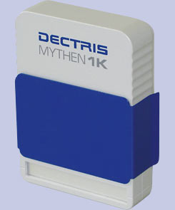

.. _camera-mythen:

Dectris Mythen camera
---------------------



Introduction
````````````

Server for the control of a Mythen detector.

Module configuration
````````````````````

Follow the generic instructions in :ref:`build_installation`. If using CMake directly, add the following flag:

.. code-block:: sh

 -DLIMACAMERA_MYTHEN=true

For the Tango server installation, refers to :ref:`tango_installation`.

Installation
````````````

Configuration
`````````````
